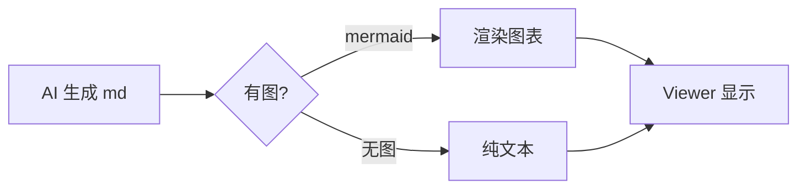

# 第一梯队功能测试

## 标题一：Mermaid

## 标题二：数学公式

行内公式 $E = mc^2$ 应当渲染，以及 $\alpha + \beta \geq \gamma$。

块级公式：

$$
\int_{-\infty}^{\infty} e^{-x^2} \, dx = \sqrt{\pi}
$$

## 标题三：锚点与目录

[点击这里跳到标题一](#标题一-mermaid)

三个标题应出现在右侧目录面板，并带层级缩进。

---

正文段落，验证渲染正常。
